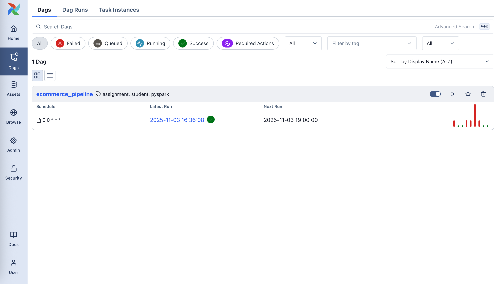
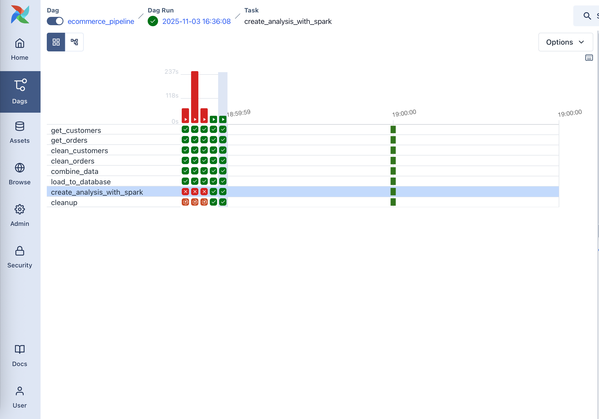
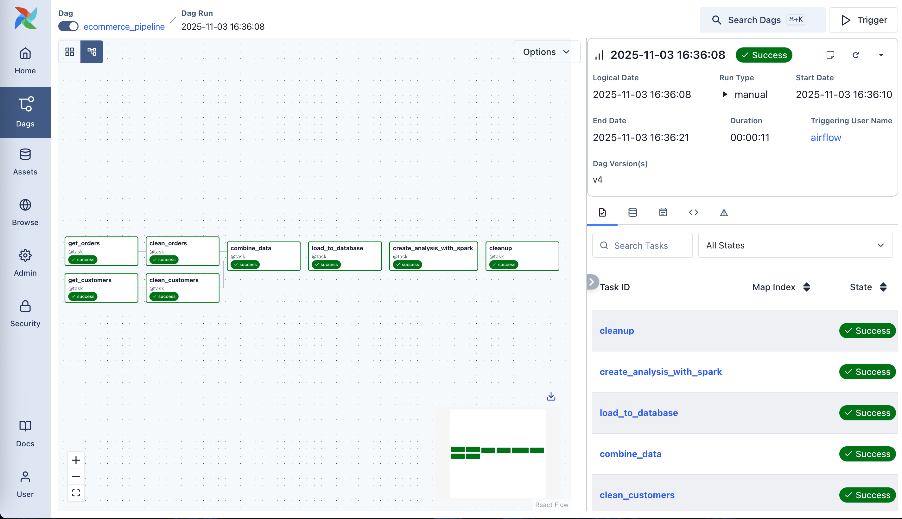
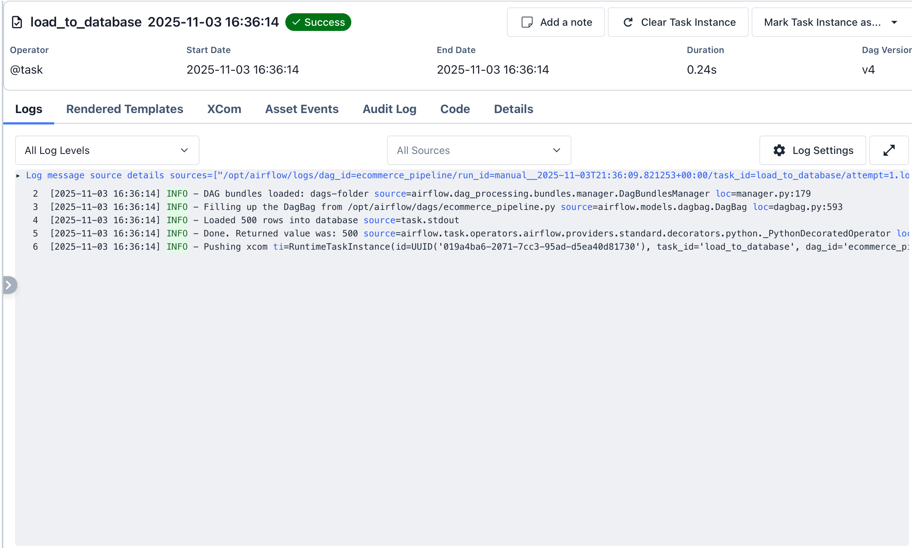
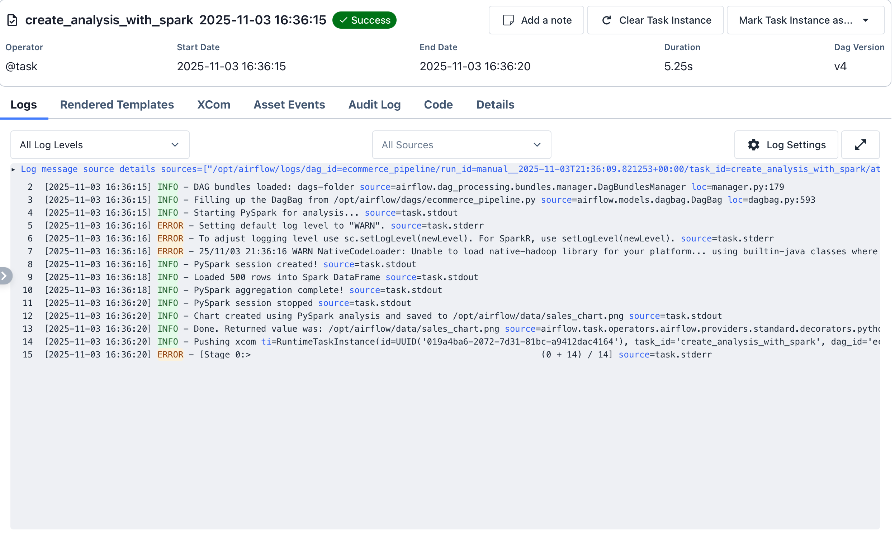
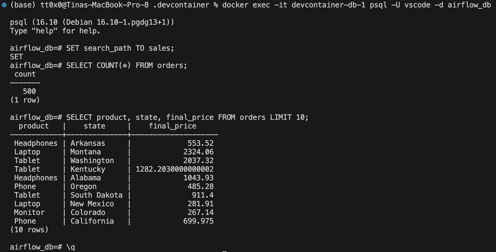

# IDS706_DE_WK10
## Airflow E-commerce Pipeline

This is an ETL pipeline using Apache Airflow to process e-commerce data with parallel execution and PySpark analysis.

## What It Does
1. Generates 200 customers and 500 orders
2. Cleans and transforms data (discounts, customer tenure)
3. Merges datasets
4. Loads into PostgreSQL
5. Analyzes with PySpark
6. Creates sales visualization

## How the Pipeline Works
**Step 1: Generate Data**  
Creates fake customer profiles and order records using the Faker library.

**Step 2: Transform Data**  
Calculates customer loyalty status and applies bulk order discounts (10% off for 3+ items).

**Step 3: Merge**  
Combines customer information with their orders using customer ID.

**Step 4: Load to Database**  
Stores all processed data in PostgreSQL for analysis.

**Step 5: Analyze with PySpark**  
Uses Spark to find top-selling states by aggregating sales totals across all orders.

**Step 6: Visualize**  
Generates a bar chart showing the top 10 states by revenue.

**Step 7: Cleanup**  
Removes temporary CSV files to keep the system clean.

Tasks 1-2 and 3-4 run in parallel.

## Requirements
- Apache Airflow 3.1.0
- PostgreSQL 16
- PySpark 3.5.0 (for distributed processing)
- Docker
- Python (Pandas, Matplotlib, Faker)

## Setup
```bash
# Clone repo
git clone https://github.com/04795t/IDS706_DE_WK10.git
cd airflow-data-pipeline

# Build and start
cd .devcontainer
docker compose build
docker compose up -d

# Access: http://localhost:8080
# Login: airflow / airflow
```

**Configure Postgres Connection:**
- Go to Admin -> Connections -> Add
- Connection ID: `Postgres`
- Type: `Postgres`
- Host: `db`
- Database: `airflow_db`
- Login: `vscode`
- Password: `vscode`
- Port: `5432`

## PySpark
Uses Spark for distributed data aggregation instead of Pandas:
```python
state_sales = df_spark.groupBy("state") \
    .agg(spark_sum("final_price").alias("total_sales")) \
    .orderBy(col("total_sales").desc()) \
    .limit(10)
```

**Why PySpark?**
- PySpark is scalable to big data, and allows for distributed processing. 

## Results
- 500 orders loaded to PostgreSQL
- Top 10 states analyzed with PySpark
- Pipeline runs in ~15 seconds
- Chart saved: `screenshots/sales_chart.png`


## Screenshots
### DAG Execution


### Successful Execution


### Graph


### Log


### PySpark Log


### Database Results


### Sales Analysis

